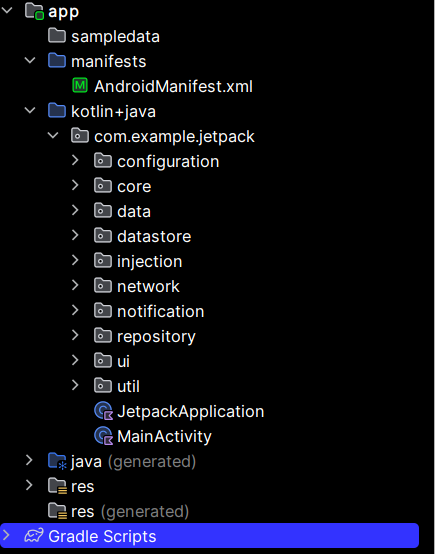

<h1 align="center">Jetpack Compose 
    A structure that is built for Android applications with Jetpack Compose
</h1>

    

# [**Table Of Content**](#table-of-content)
- [**Table Of Content**](#table-of-content)
- [**Introduction**](#introduction)
- [**Sample**](#sample)
- [**Packages**](#packages)
- [Made with 💘 and Kotlin ](#made-with--and-kotlin-)

# [**Introduction**](#introduction)

This is my Android sample app that is built with 100 % Kotlin and Jetpack Compose components. I writes this repository because this is my knowledge & experience from realities that i do everyday. In additional, inspired from [**Android Architecture Samples**](https://github.com/android/architecture-samples), this application is a general combination from many application that i have written. They always have splash screen, home screen, setting screen, menu bottom bar, send notifications daily,... and so forth.

# [**Sample**](#sample)

In my repository, you will find:

• User Interface built with [**Jetpack Compose**](https://developer.android.com/jetpack/compose/documentation)

• A single-activity architecture, using [**Navigation Component**](https://developer.android.com/guide/navigation/navcontroller)

• A presentation layer that contains a Compose screen (View) and a ViewModel per screen (or feature)

• Reactive UIs using [**Flow**](https://developer.android.com/kotlin/flow) and [**Kotlin Coroutines**](https://developer.android.com/kotlin/coroutines) for asynchronous operations

• Dependency injection with [**Hilt**](https://developer.android.com/training/dependency-injection/hilt-android)

# [**Packages**](#packages)

    

<h3 align="center">

***PACKAGE STRUCTURE***
</h3>

There are many packages in my repository (as any casual application ✌️😎). You can see similiar

• **configuration**

• **core**

• **data**

• **datastore**

• **injection**

• **network**

• **notification**

• **repository**

• **ui**

• **util**

• **Jetpack Application**

• **Main Activity** 

# [Made with 💘 and Kotlin ](#made-with-love-and-kotlin)